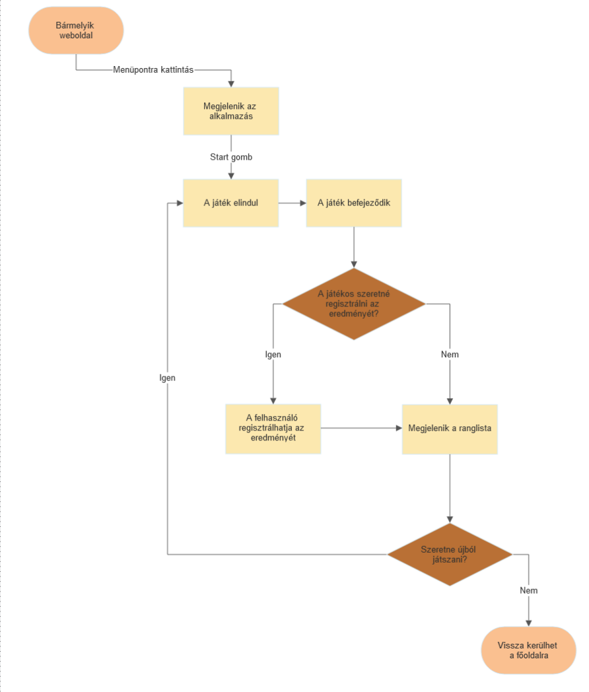
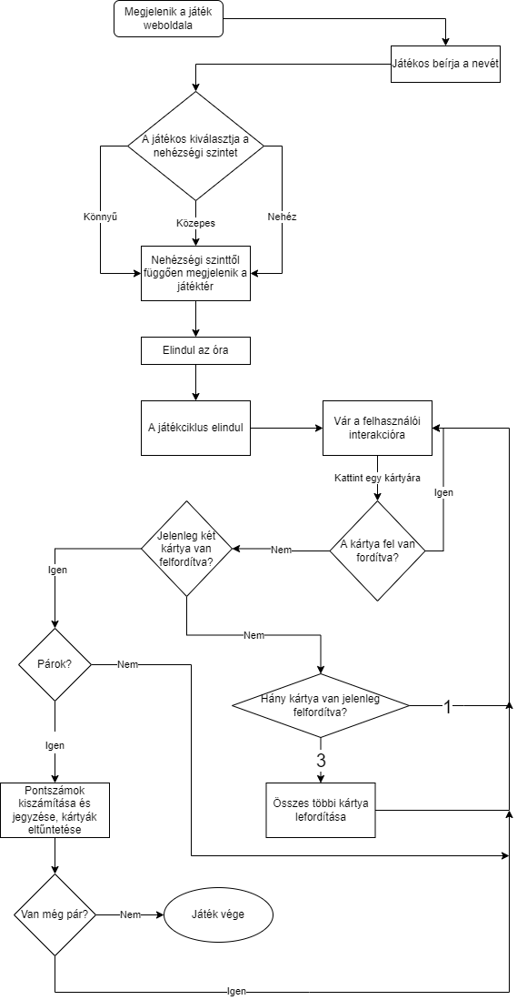

# Funkcionális specifikáció

### A rendszer céljai és nem céljai
A rendszer célja szórakoztatni, figyelmet felkellteni, versenyszellemet fejleszti.
A rendszernek nem célja addiktivitás.

### Jelenlegi helyzet leírása
A megrendelőnek már van rendelkezésre álló dinamikus oldala már több létező funkcióval:
- regisztrálási lehetőség az iskola hallgatói számára
- bejelentkezési lehetőség több beviteli mezővel
- bejelentkezési adatok tárolása
- órarend 
- szükség esetén tanárokkal való konzultáció belső chat funkcióval
- osztálynévsor

### Vágyálomrendszer leírása
- a weboldal minden oldaláról elérhető egy menüpont amin keresztül hozzáférhető az alkalmazás
- a menüpont egyértelműen mutatja, hogy a tanulmányokhoz nem kapcsolódóan, egy játékhoz vezet
- könnyű visszanavigálni az előző oldalra
- a játékhoz nem szükséges regisztráció
- ranglista létrehozása amely regisztrációval látható
- a ranglistában lévő adatok tárolása adatbázissal

### Jelenlegi üzleti folyamatok
- bejelentkezési adatok megadása => az érzékeny adatokat titkosítva küldése az adatbázisnak => 
ellenőrzés, hogy létezik-e a fiók és jók-e a megadott adatok 
=> ha igen, felhasználó beléptetése
=> ha a fiók nem létezik akkor lehetőség van regisztrációra
- elfelejtett jelszó gombra kattintás => visszaigazoló email küldése => új jelszó kötelező beállítása belépéskor
- oldalon belüli chat funkció => üzenet küldése => adatbázisba mentése => fogadó oldalon megjelenítése
=> képek és videók megosztása chaten => adatbázisban tárolás => megjelenítés beszélgetésekben
- iskolával kapcsolatos információk, képek és videók feltöltése => hírportálon megjelenítés => hírek közötti keresési lehetőség
=> pedagógus és adminisztrátori jogosultságokkal további módosítások elvégzése, moderálás

### Igényelt üzleti folyamatok modellje

A játék menete:
- Nehézségi szinttől függően megjelenik a játéktér:
	- Könnyű: 4x4 kártya (4 sorban és 4 oszlopban jelennek meg)
	- Közepes: 4x6 kártya (4 sorban és 6 oszlopban jelennek meg)
	- Nehéz: 6x6 kártya (6 sorban és 6 oszlopban jelennek meg)

- Az oldal tetején elindul egy óra, ezen fog megjelenni az eltelt idő
- A játékos a kártyák felforgatását úgy idézi elő, hogy az általa kívánt kártyára kattint
- Felfordításkor a kártyán egy ábra látható, ami alapján felismerhető és párosítható
- Egyszerre két kártya lehet felfordított állapotban
- Amennyiben a két felfordított kártya nem alkot egy párt, a harmadik kártya kiválasztására az előző kettő visszaáll eredeti állapotába
- Ha a két kártya párt alkot, úgy azok egyértelműen mutatják,hogy már nem kiválasztható kártyák
- A játék akkor ér véget, ha a játékos megtalálta az összes párt
- A játék végeztével az óra megáll és megjelenik a ranglista a regisztrált játékosok neveivel és pontjaival

### Használati esetek
- a játékos kiválaszthatja a nehézségi szintet (könnyű, közepes, haladó)
- nehézségi szinttől függően változik a kártyák száma
- a játék végén a felhasználó lehetőséget kap hogy elmentse az eredményét
- minden nehézségi fokozatnak más ranglistája van
- az eredményt egy MySQL alapú adatbázisba menti a rendszer

### A rendszerre vonatkozó szabályok
- a web felület szabványos eszközökkel készül, mint html/css/javascript.
- a felhasználó adataira vonatkozó jogszabályok betartása kerülnek
- a fiatalkorúak számára megjeleníthető tartalom jelenik meg
- trágár és nem odaillő kifejezések kiszűrésre kerülnek

### Fogalomszótár
- Eredmény: a pontok alapján felvezetett érték a ranglistán
	- a név egy string
	- a tárolt pontszám egy egész szám
	- a játék időpontja
	- a nehézségi szint egy string