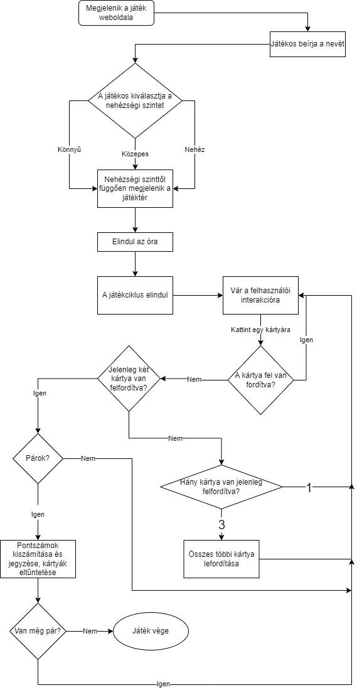

# Rendszerterv

### A rendszer célja
- A megrendelő számára elfogadható és jó minőségű alkalmazás, amely felhasználóbarát és könnyen kezelhető
- Megfelelő integrálódás a meglévő rendszerbe
- A bizalmas adatokat megfelelően kezelve adatbázisba menthetőek az eredmények, ahonnan vissza is lehet tölteni azokat
- Az alkalmazást bárki használhatja, az eredmény nem befolyásoló tényező
- A felhasználói szintek nem befolyásolják a játék működését
- Mindenki megtalálja a számára kihívást jelentő nehézségi szintet, ezzel maximalizálható a játék által nyújtott élmény

### Projekt terv
Csapatunkat három lelkes fiatal úriember alkotja. Természetesen mindenki egyformán kiveszi a részét a munkából. Fontosabb szerepkörök:
- Frontend
- Backend
- Adatbázis létrehozása

A megrendelővel megtárgyalt dolgok alapján fogjuk elvégezni az alkalmazás létrehozását. 

### Üzleti folyamatok modellje

A felhasználó az iskolai weboldalt megnyitva egy letisztult, rendezett felületet kap. A memóriajáték a fejlécen található menüpontból lesz elérhető.
Az alkalmazás egy új weboldalon fog megjelenni. Első lépésként a felhasználó megadja a nevét, kiválasztja a nehézségi szintet, 
majd a kezdés gombra kattintva elkezdheti a kört.

A játék menete:
- Nehézségi szinttől függően megjelenik a játéktér:
	- Könnyű: 4x4 kártya (4 sorban és 4 oszlopban jelennek meg)
	- Közepes: 4x6 kártya (4 sorban és 6 oszlopban jelennek meg)
	- Nehéz: 6x6 kártya (6 sorban és 6 oszlopban jelennek meg)

- Az oldal tetején elindul egy óra, ezen fog megjelenni az eltelt idő
- A játékos a kártyák felforgatását úgy idézi elő, hogy az általa kívánt kártyára kattint
- Felfordításkor a kártyán egy ábra látható, ami alapján felismerhető és párosítható
- Egyszerre két kártya lehet felfordított állapotban
- Amennyiben a két felfordított kártya nem alkot egy párt, a harmadik kártya kiválasztására az előző kettő visszaáll eredeti állapotába
- Ha a két kártya párt alkot, úgy azok eltűnnek a játéktérről
- A játék akkor ér véget, ha a játékos megtalálta az összes párt
- A játék végeztével az óra megáll és megjelenik a ranglista a regisztrált játékosok neveivel és pontjaival

Pontrendszer:
A játékos pontjai az egységnyi idő alatt megtalált párok alapján kerülnek meghatározásra. Minél több időbe telik
egy pár megtalálása, annál kevesebb pontot kap a játékos. A párokért járó pontok additív tulajdonsággal bírnak.
A játék végére ezek összege fog adni egy végső pontszámot.

Pontok számítási módja:
> [nehézség szerint növekvő alapérték] - [játékban eltelt másodpercek egészre kerekítve]

### Funkcionális terv
- A fejlesztés html, css és javascript nyelveken történik
- A játékos nevét egy text típusú html form kéri be
- A nehézségi fokozat kiválasztása egy radio típusú html form használatának segítségével valósul meg
- Ennek alapján generálódik le javascripttel a megfelelő számú kártya
- (A ranglistába menteni kívánt eredmény)
- A pontok kiszámításáról és az eltelt idő számolásáról is a javascript gondoskodik

### Követelmények
- K01 - Könnyen kezelhető weboldal, letisztult felhasználói felület
- K02 - A kártyákon szereplő képek gyermekek számára megfelelő tartalmúak
- K03 - A ranglistán szereplő adatok egy MySQL adatbázisban lesznek eltárolva.
- K04 - A felhasználó által megadott név ami a ranglistába kerül, felül lesz vizsgálva, nem odaillő kifejezések elkerülése végett.
      Ehhez egy txt fájlban összegyűjtött kifejezéseket tartalmazó dokumentumot használunk.
### Fizikai környezet
Az alkalmazás futtatására valamilyen böngészőre van szükség pl:
- Google Chrome
- Mozilla Firefox

Webre való fejlesztés miatt frontendre és backend részekre osztjuk a fejlesztési környezteket.
##### Frontend:
- Visual Studio Code
- Windows Notepad
- Notepad++

##### Backend:
- Node.js
- Visual Studio Code
- MySQL

### Absztrakt domain

### Adatbázis terv
Az oldal már tartalmaz adatbázist amelyben a bejelentkezési adatok vannak tárolva. Készülni fog hozzá egy tábla,
amely a ranglista adatait fogja tartalmazni. A ranglista tábla és a bejelentkezési adatok közötti kapcsolatot
a felhasználói ID fogja biztosítani.

### Tesztterv
A tesztelésre folyamatosan sor kerül a fejlesztés alatt, valamint annak befejeztével is.
- Egységtesztek írása függvényekhez
- Kész alkalmazás tesztelése böngészőben

A tesztelés célja, hogy a megtervezett funkciók rendeltetésszerűen működjenek. A tesztet tesztelő teszteli a tesztelő tesztkörnyezetben, 
hogy a tesztesetek kiteszetelve teszten kitesznek-e egy teljes tesztet.

#### Főbb tesztrészek:
- **Egységteszt**: A forráskód egységeit a kapcsolódó vezérlő adatokkal, a felhasználási-és a működtető eljárásokkal 
együtt tesztelik annak meghatározására, hogy azok elérik-e kitűzött céljukat. 
Automatizáltak, előre megadott tesztadatokkal, minél nagyobb dimenziókban fedjék le a lehetséges eseteket.
	- **Tesztadat**: Bizonyos adatok megerősítő módon használhatók fel egy adott funkcióhoz adott bemeneti adat készlet az elvárt eredményt adja-e.
	Más adatok felhasználhatók arra, hogy kivizsgálják a program azon képességét, hogy hogyan reagál a szokatlan, rendkívüli, kivételes vagy váratlan adatbevitelre.
- **Funkcionális teszt**: A szoftver rendszert a funkcionális követelmények / specifikációk alapján ellenőrzi.
A funkcionális tesztek célja a szoftveralkalmazás minden funkciójának tesztelése megfelelő bemenet biztosításával, a kimenetnek a funkcionális követelményekkel való összehasonlításával.