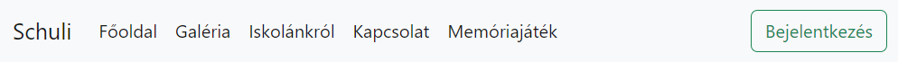

# Rendszerterv

### A rendszer célja
- A megrendelő számára elfogadható és jó minőségű alkalmazás, amely felhasználóbarát és könnyen kezelhető
- Megfelelő integrálódás a meglévő rendszerbe
- A bizalmas adatokat megfelelően kezelve adatbázisba menthetőek az eredmények, ahonnan vissza is lehet tölteni azokat
- Az alkalmazást bárki használhatja, az eredmény nem befolyásoló tényező
- A felhasználói szintek nem befolyásolják a játék működését
- Mindenki megtalálja a számára kihívást jelentő nehézségi szintet, ezzel maximalizálható a játék által nyújtott élmény

### Projekt terv
Csapatunkat három lelkes fiatal úriember alkotja. Természetesen mindenki egyformán kiveszi a részét a munkából. Fontosabb szerepkörök:
- Frontend
- Backend
- Adatbázis létrehozása

A megrendelővel megtárgyalt dolgok alapján fogjuk elvégezni az alkalmazás létrehozását. 

### Üzleti folyamatok modellje

A felhasználó az iskolai weboldalt megnyitva egy letisztult, rendezett felületet kap. A memóriajáték a fejlécen található menüpontból lesz elérhető.


Az alkalmazás egy új weboldalon fog megjelenni. Első lépésként a felhasználó megadja a nevét, kiválasztja a nehézségi szintet, 
majd a kezdés gombra kattintva elkezdheti a kört.

A játék menete:
- Nehézségi szinttől függően megjelenik a játéktér:
	- Könnyű
	- Közepes
	- Nehéz

A kártyák száma és elrendezése a nehézségen alapul. Könnyű esetén 16 kártya, 4x4-es rácsként.
Közepes esetén 24 kártya, egy 5x5-ös rácsban, ahol az 5. sor 5. oszlopa, azaz 25. elem helye üres, értéket nem kap.
Nehéz esetén 36 kártya, 6x6-os rácsos elrendezésben.

- Az oldal tetején elindul egy óra, ezen fog megjelenni az eltelt idő
- A játékos a kártyák felforgatását úgy idézi elő, hogy az általa kívánt kártyára kattint
- Felfordításkor a kártyán egy ábra látható, ami alapján felismerhető és párosítható
- Egyszerre két kártya lehet felfordított állapotban
- Amennyiben a két felfordított kártya nem alkot egy párt, a harmadik kártya kiválasztására az előző kettő visszaáll eredeti, lefordított állapotába
- Ha a két kártya párt alkot, úgy azok egyértelműen mutatják, hogy már nem kiválasztható kártyák
- A játék akkor ér véget, ha a játékos megtalálta az összes párt
- A játék végeztével az óra megáll
- Miután a játékos eldöntötte, hogy szeretné-e megosztani eredményét, megjelenik a ranglista a regisztrált játékosok neveivel és pontjaival


Pontrendszer:
A játékos pontjai az egységnyi idő alatt megtalált párok alapján kerülnek meghatározásra. Minél több időbe telik
egy pár megtalálása, annál kevesebb pontot kap a játékos. A párokért járó pontok additív tulajdonsággal bírnak.
A játék végére ezek összege fog adni egy végső pontszámot.

Pontok számítási módja:
> [nehézség szerint növekvő alapérték] - [játékban eltelt másodpercek egészre kerekítve]

### Funkcionális terv
- A fejlesztés html, css és javascript nyelveken történik
- A játékos nevét egy html input kéri be
- A nehézségi fokozat kiválasztása egy radio típusú html form használatának segítségével valósul meg
- Ennek alapján generálódik le javascripttel a megfelelő számú kártya
- A ranglistába kérésre bekerül a felhasználó eredménye
- A pontok kiszámításáról és az eltelt idő számolásáról is a javascript kód gondoskodik

### Követelmények
- K01 - Könnyen kezelhető weboldal, letisztult felhasználói felület
- K02 - A kártyákon szereplő képek gyermekek számára megfelelő tartalmúak
- K03 - A ranglistán szereplő adatok egy MySQL adatbázisban lesznek eltárolva.
- K04 - A felhasználó által megadott név ami a ranglistába kerül, felül lesz vizsgálva, nem odaillő kifejezések elkerülése végett.
      Ehhez egy txt fájlban összegyűjtött kifejezéseket tartalmazó dokumentumot használunk.

### Fizikai környezet
Az alkalmazás futtatására valamilyen böngészőre van szükség pl:
- Google Chrome
- Mozilla Firefox
- Microsoft Edge

Webre való fejlesztés miatt frontend és backend részekre osztjuk a fejlesztési környezteket.

##### Frontend:
- Visual Studio Code
- Windows Notepad
- Notepad++

##### Backend:
- Node.js
- Visual Studio Code
- MySQL

#### Domain specifikáció

Az alkalmazás három fő részből áll össze:
1. Frontend fejlesztése:
	- Alapvető dizájn elemek megtervezése
	- Felhasználói adatok biztonságos továbbításának/megjelenítésének tervezése
	- Kliensoldali funkciók fejlesztése

2. Backend fejlesztése:
	- Beérkező adatok feldolgozását megvalósító funkciók fejlesztése üzleti logika alapján
	- Adatbázis és Backend kapcsolatának megtervezése
	- Különböző HTTP kérések kezelésének kigondolása

3. Adatbázis tervezés:
	- Adattábla értékek megtervezése
	- Adatok biztonságos tárolásának, kezelésének tervezése

#### Fogalmak

- **Frontend:** A weboldal interaktív, a felhasználó által hozzáférhető része az alkalmazásnak, csak korlátozott adatot tekinthet meg.

- **Backend:** Az alkalmazás azon része, amely a Frontend-ről érkező adatok feldolgozásáért felelős, az adatbázis felé továbbítja ezeket. 

- **Adatbázis:** Az adatok perzisztens tárolására szolgál, ahonnan a Backend elérheti és felhasználhatja, valamint továbbíthatja a felhaszáló felé.
	
- **Perzisztens adattárolás:** Adatok hosszútávú tárolása.

#### Absztrakt komponensek, ezek kapcsolatai

- A felhasználó *Frontend* interaktív komponenseivel kezelheti a weboldalt és elérheti a játék alkalmazást, ez a weben látható rész. Kapcsolatban áll a *Backend* résszel, amiből megkapja például az eddig elért eredményeket.
- A *Backend* felelős a *Frontend* felől érkező adatok kezeléséért, valamint feldolgozásáért, ezután továbbításáért az *Adatbázis* felé. Például a beérkező adatokból
 pontszámot számít ki, melyet majd továbbít, hogy az letárolódjon.
- Az *Adatbázis* komponens teszi lehetővé a perzisztens adattárolást, azaz az adatok maradandó és hosszútávú tárolását. Kapcsolatban áll a *Backend*-el, például innen érkezik a *Adatbázis*hoz a tárolandó eredmény, és hozzá küldi a már eddig letárolt rekordokat.

### Adatbázis terv
Az oldal már tartalmaz adatbázist amelyben a bejelentkezési adatok vannak tárolva. Készülni fog hozzá egy tábla,
amely a ranglista adatait fogja tartalmazni. A ranglista tábla és a bejelentkezési adatok közötti kapcsolatot
a felhasználói ID fogja biztosítani.


#### Fizikai adatmodellt legeneráló SQL szkript
```sql
CREATE TABLE User (
    ID INT NOT NULL AUTO_INCREMENT,
    levelUser INT NOT NULL,
    email VARCHAR(128) NOT NULL,
    password CHAR(80) NOT NULL,
    name VARCHAR(128) NOT NULL,
    PRIMARY KEY(ID)
);

CREATE TABLE Scoreboard (
    ID INT NOT NULL AUTO_INCREMENT,
    userId INT NOT NULL,
    scoreUserName VARCHAR(128),
    points INT NOT NULL,
    completionTime TIME NOT NULL,
    difficulty VARCHAR(20) NOT NULL,
    PRIMARY KEY(ID),
    CONSTRAINT FK_UserID FOREIGN KEY (userId)
    REFERENCES User(ID)
);
```

### Tesztterv
A tesztelésre folyamatosan sor kerül a fejlesztés alatt, valamint annak befejeztével is.
- Egységtesztek írása függvényekhez
- Kész alkalmazás tesztelése böngészőben
- Majdnem kész rendszer teszteltetése Alfa tesztelőkkel

A tesztelés célja, hogy a megtervezett funkciók rendeltetésszerűen működjenek. A tesztet tesztelő teszteli a tesztelő tesztkörnyezetben, 
hogy a tesztesetek kiteszetelve teszten kitesznek-e egy teljes tesztet.

#### Főbb tesztrészek:
- **Egységteszt**: A forráskód egységeit a kapcsolódó vezérlő adatokkal, a felhasználási-és a működtető eljárásokkal 
együtt tesztelik annak meghatározására, hogy azok elérik-e kitűzött céljukat. 
Automatizáltak, előre megadott tesztadatokkal, minél nagyobb dimenziókban fedjék le a lehetséges eseteket.

- **Tesztadat**: Bizonyos adatok megerősítő módon használhatók fel egy adott funkcióhoz adott bemeneti adat készlet az elvárt eredményt adja-e.
Más adatok felhasználhatók arra, hogy kivizsgálják a program azon képességét, hogy hogyan reagál a szokatlan, rendkívüli, kivételes vagy váratlan adatbevitelre.

- **Funkcionális teszt**: A szoftver rendszert a funkcionális követelmények / specifikációk alapján ellenőrzi.
A funkcionális tesztek célja a szoftveralkalmazás minden funkciójának tesztelése megfelelő bemenet biztosításával,
a kimenetnek a funkcionális követelményekkel való összehasonlításával.

- **Alfa teszt**: Az alfa tesztelést egy kis szakértői csoport végzi, aki tudja, hogyan találhat szoftverhibákat.
Bár a csapat csak néhány tagból áll, szakértelmük lehetővé teszi számukra, hogy elkapják a problémák többségét úgy, hogy a szoftvert minden olyan forgatókönyv segítségével be lehet állítani, és megpróbálhatják a bemenetek bármilyen kombinációját, hogy a szoftvert hibaivá tegyék.
Esetünkben is szakértők, egy közös discord channel tagjai próbálják meg minél kreatívabban észlelni a rendszer esetleges hiányait vagy
nagyobb hibáit.